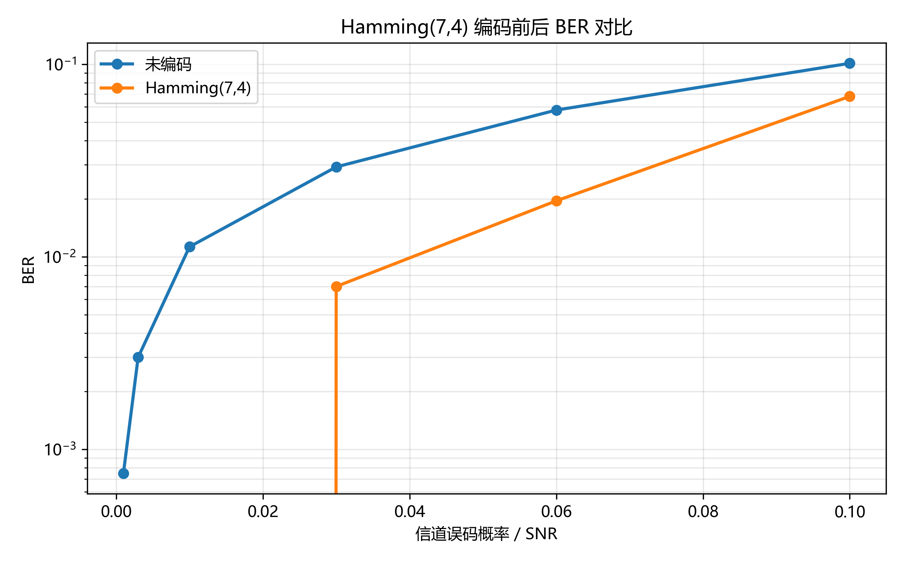
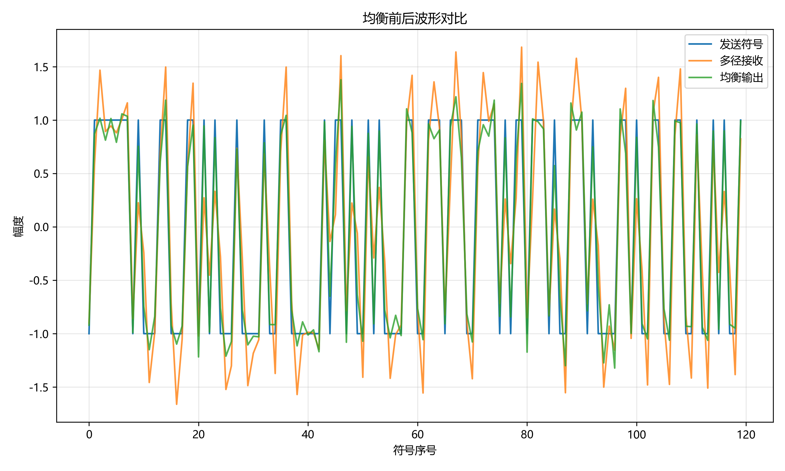
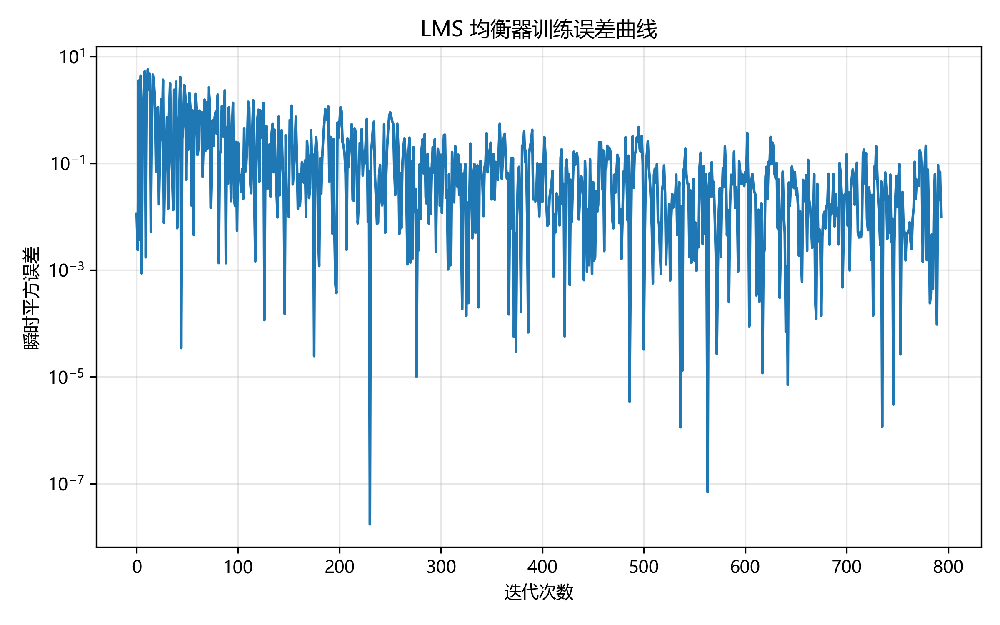

# 无线通信技术实验报告：信道编码与信道均衡

## 1. 实验目的

本实验围绕无线通信系统中的可靠传输与符号间干扰抑制展开。通过补全 Hamming(7,4) 信道编码、伴随式检测、单比特纠错译码、ZF 均衡器、FIR 滤波器和 LMS 自适应均衡器，理解冗余编码如何降低误码率，也理解多径信道造成 ISI 后如何通过均衡恢复符号。实验还要求运行本地 pytest、生成结果图并使用自动评分脚本检查提交完整性。

## 2. 实验原理

Hamming(7,4) 是一种线性分组码，每 4 个信息比特生成 7 个码字比特。本实验采用系统码形式，前 4 位保留信息位，后 3 位为校验位。编码时把信息块 `u` 与生成矩阵 `G` 相乘并在 GF(2) 上取模，得到 `c = uG mod 2`。接收端使用校验矩阵 `H` 计算伴随式 `s = rH^T mod 2`。如果 `s` 为零，说明未检测到单比特错误；如果 `s` 非零，则将它与 `H` 的列向量比较，匹配到哪一列就翻转对应的码字比特，随后取前 4 位作为译码信息。

卷积码属于有记忆的信道编码。本实验选做部分实现了约束长度为 3、码率为 1/2 的卷积码，生成多项式为 `g1=111` 和 `g2=101`。编码器在末尾补 2 个 0 作为尾比特，使状态回到全零。Viterbi 硬判决译码把每两个接收比特视为一个分支观测，用汉明距离作为分支度量，动态保留到各状态的最小路径度量，最终从全零状态回溯得到原始信息比特。

多径信道会让当前接收符号混入相邻符号的贡献，即符号间干扰。ZF 均衡器的目标是寻找一组 FIR 抽头，使信道响应与均衡器响应的卷积尽量接近单位冲激响应。实现中构造卷积矩阵 `A`，令 `A @ taps` 表示联合响应，再用最小二乘求解目标冲激响应。LMS 均衡器是自适应方法，根据训练序列逐点计算输出误差 `e[n]=d[n]-y[n]`，再按 `w = w + mu e[n] x[n]` 更新抽头，使均方误差逐渐下降。

## 3. 实验环境

- Python 版本：本地运行环境为 Python 3.8.3。
- 主要依赖：NumPy、Matplotlib、pytest、pylint。
- 操作系统：Windows，本地工作目录为实验仓库根目录。
- AI 使用情况：使用 AI 助手辅助阅读实验文档、定位 TODO、解释测试要求、实现代码并运行本地验证。最终代码已经通过本地单元测试和评分脚本检查。

## 4. 实验方法

Part 1 中，先把输入比特检查为一维 0/1 数组，并保证长度为 4 的倍数；随后 reshape 为若干 4 比特块，使用 `HAMMING_G` 完成矩阵编码。译码阶段先把接收序列 reshape 为 7 比特码字，对每个码字计算伴随式；如果伴随式非零，则与 `HAMMING_H` 的每一列比较，定位并翻转单比特错误，最后输出系统码的前 4 位。选做部分补充了卷积码编码与 Viterbi 硬判决译码，并额外做了编码译码回环自检。

Part 2 中，ZF 均衡器通过显式构造卷积矩阵，把有限长 FIR 抽头求解问题转化为最小二乘问题。`apply_fir_filter` 使用 `np.convolve(..., mode='full')` 并截取前 `len(signal)` 个样本，保证输出长度与输入一致。LMS 均衡从 `num_taps - 1` 位置开始训练，每次取当前和历史接收样本组成输入向量，计算输出、误差和抽头更新，返回最终抽头与误差序列。

## 5. 实验结果

本地已运行以下命令：

```bash
python -m pytest grading/test_part1_coding.py -v
python -m pytest grading/test_part2_equalization.py -v
python src/part1_channel_coding.py
python src/part2_equalization.py
python grading/calculate_grade.py
```

Part 1 和 Part 2 的函数测试均通过，实验脚本生成了三张结果图：







Part 2 演示脚本输出显示，均衡前 BER 为 0.0010，LMS 均衡后 BER 为 0.0000，说明在该仿真参数下均衡器有效降低了残余判决错误。

## 6. 结果分析

Hamming(7,4) 能纠正单比特错误，是因为每个码字位置对应 `H` 中一个唯一的非零列向量。单个比特翻转后，伴随式正好等于该位置的列向量，因此接收端可以定位错误位置并翻转修正。它的代价是码率从 1 下降到 4/7，即发送了额外校验位来换取更好的可靠性。

从 BER 曲线可以看出，在二元对称信道误码概率较低时，Hamming 编码后的译码结果通常优于未编码传输；当错误概率变高时，一个码字中出现多比特错误的概率增加，Hamming(7,4) 只能可靠纠正单比特错误，因此性能收益会受到限制。

ZF 均衡通过逼近冲激响应来压低旁瓣，从而削弱 ISI。但如果信道频响存在很小的幅度或近似零点，ZF 会为了强行反演信道而放大噪声。LMS 均衡则依赖训练序列和步长：步长太大会导致抽头震荡甚至发散，步长太小则收敛慢。实验中的 LMS 误差曲线总体下降，说明抽头在训练过程中逐渐逼近有效的均衡解。

## 7. 实验心得

本实验把信道编码和信道均衡放在同一个通信链路背景下，有助于区分两类技术的作用位置：Hamming 编码主要应对随机比特错误，均衡器主要处理多径造成的 ISI。实现时最容易出错的是矩阵和序列的对齐，例如 Hamming 伴随式要与校验矩阵列比较，LMS 输入窗口也要与期望符号保持一致。自动测试能快速暴露这些边界问题，先通过单元测试再运行 demo 是比较稳妥的实验流程。

AI 辅助提高了查找 TODO、理解评分脚本和调试边界条件的效率，但实验结论仍需要结合代码运行结果来确认，不能只依赖生成的解释或代码片段。

## 8. 参考资料

- 课程第 6 章：信道编码。
- 课程第 7 章：信道均衡。
- 实验仓库 README、实验指导文档和自动评分脚本。
